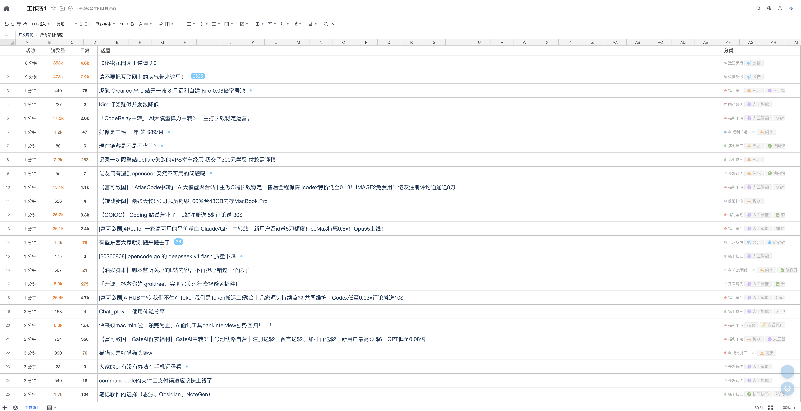
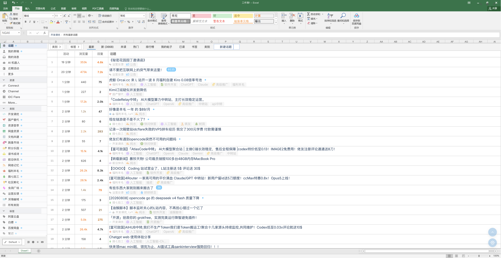
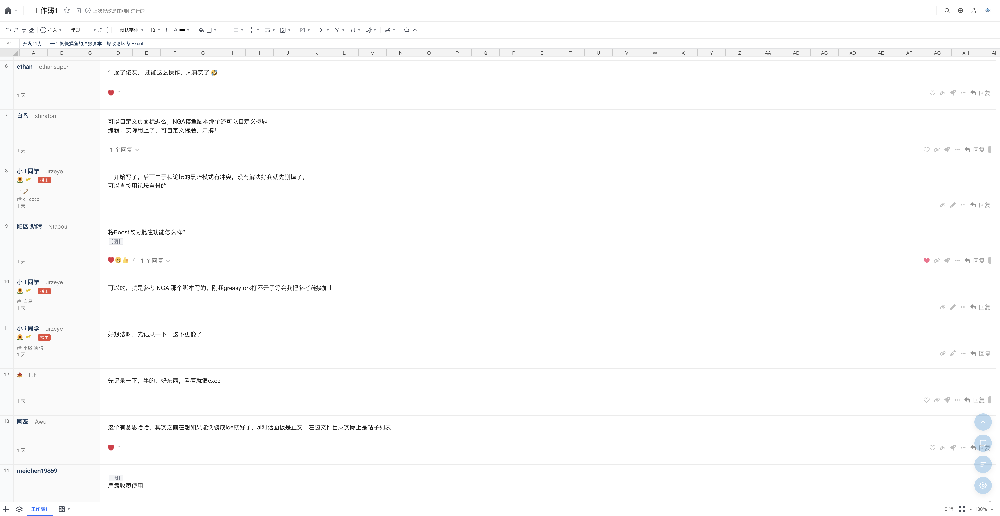
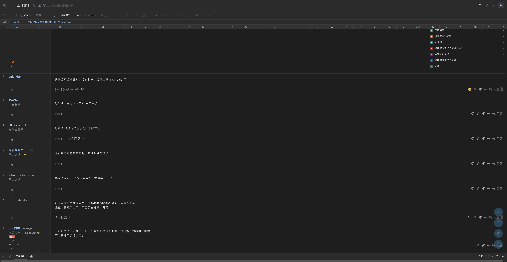

# LINUX DO 优化摸鱼体验

> Discourse / [LINUX DO](https://linux.do) 论坛显示优化与功能增强，装完即摸鱼。

**最新版本**: v1.1.35  
**脚本文件**: [`linuxdo-moyu.user.js`](./linuxdo-moyu.user.js)  
**仓库地址**: [urzeye/tampermonkey-scripts](https://github.com/urzeye/tampermonkey-scripts)  
**适配站点**: [linux.do](https://linux.do) · [idcflare.com](https://idcflare.com)（同架构 Discourse）

灵感来自 [NGA 优化摸鱼体验](https://github.com/kisshang1993/NGA-BBS-Script)，针对 Discourse 重写；Excel 主题资源沿用其 MIT 授权素材。

---

## 预览

### 列表 · 腾讯文档皮肤

元数据前置、行号、分类列等表格化列表。

### 列表 · Microsoft Excel 皮肤

完整 Office 顶栏伪装 + 左侧导航。

### 帖子详情

楼层表格化、用户列两行信息、快捷回复 FAB。

### 帖子详情 · 深色模式

Excel 深色阅读路径。

### 设置面板

显示优化、Excel 子选项、字体/图片滑块等。

---

## 安装

1. 浏览器安装 [Tampermonkey](https://www.tampermonkey.net/)（或兼容的用户脚本管理器）
2. 打开本仓库中的 [`linuxdo-moyu.user.js`](./linuxdo-moyu.user.js)，按提示安装
3. 访问 [linux.do](https://linux.do)，默认开启 **Excel 摸鱼外观** + **紧凑模式**

油猴菜单可直接「打开摸鱼设置」；页面内快捷键 `S` 同样打开设置面板。

---

## 功能一览

### Excel 摸鱼外观（核心，默认开启）

把论坛伪装成在线表格，降低「在摸鱼」的观感。

| 能力 | 说明 |
| --- | --- |
| 腾讯文档 / Microsoft Excel 皮肤 | 顶栏、底栏、工作表标签、favicon 一并伪装 |
| 列表表格化 | 行号、列头、单元格风格；支持悬停/选中 |
| **元数据前置**（默认开） | 活动 / 浏览 / 回复挪到标题列前，扫一眼先看热度 |
| 分类列 | 分类/标签可单独成列，或保留在标题下方 |
| 帖内楼层表格化 | `行号 \| 用户信息 \| 正文`；用户列两行排布（昵称/ID + 称号/flair/楼主） |
| **Boost 批注**（默认关） | 帖内 boost 收成批注样式，减少对表格阅读的干扰 |
| **快捷回复 FAB** | 帖子页悬浮回复，唤起原生 composer 并聚焦输入 |
| 全页搜索适配 | 搜索结果行表格化，公式栏展示关键词与选中项 |
| 工作簿标题 / 首页 | 标题可自定义（默认「工作簿1」）；标题与房子图标均可回首页 |
| A1 导航 | 公式栏展示「板块 › 帖子」等路径，可点击跳转 |
| 行号 / 导航侧栏 | 行号可开/关；可隐藏顶栏导航 + 左侧分类侧栏 |
| 深色模式 | 列表 + 帖文阅读路径适配深色（含导航、帖脚、boost、composer 等） |
| 快捷键 | `X` 开关 Excel；Excel 开启时 `H` 切换导航/侧栏 |

### 显示优化

| 功能 | 默认 | 快捷键 | 说明 |
| --- | --- | --- | --- |
| 隐藏头像 | 开 | `Q` | 隐藏帖内/列表头像 |
| 隐藏表情 | 关 | `W` | 隐藏 emoji，以 `[alt]` 文本替代 |
| 隐藏楼内图片 | 关 | `E` | 以 `[图]` / `[图×n]` 占位；点击临时显示 |
| 隐藏用户标题 | 开 | - | 隐藏 user-title / 状态文案 |
| 隐藏侧边栏 | 关 | `H`* | 非 Excel 时隐藏左侧栏；Excel 开启时由「导航/侧栏」接管 |
| 隐藏话题地图 | 开 | - | 隐藏 topic map |
| **紧凑模式** | **开** | - | 压缩列表行高与详情楼层间距（Excel 下同样生效） |
| 宽屏模式 | 开 | - | 仅关闭 Excel 时生效；Excel 已强制全宽 |

\* Excel 开启时 `H` 控制「导航/侧栏」，而不是普通 hideSidebar。

### 功能增强

| 功能 | 默认 | 快捷键 | 说明 |
| --- | --- | --- | --- |
| 高亮楼主 | 开 | - | 楼主标记与高亮色可自定义 |
| 只看楼主 | 关 | `R` | 仅显示楼主楼层 |
| 黑名单 / 备注 | 开 | - | 屏蔽用户、彩色备注标签；拉黑模式：隐藏 / 移除 |
| 关键字屏蔽 | 开 | - | 可匹配标题/正文，可选正则 |
| 新标签打开帖子 | 关 | - | 列表标题新开标签 |
| 图片增强预览 | 开 | ←/→ | 缩放、拖拽、旋转、切图 |
| 楼层跳转 | 开 | - | 浮动按钮跳转到指定楼层 |
| 返回顶部 | 开 | - | 右下角快捷按钮 |

### 设置与配置

- 设置面板：快捷键 `S` / 油猴菜单 / 浮动按钮 ⚙
- **字体大小偏移**、**楼内图片最大宽度**：滑块调节 + 实时预览（开 Excel 不会整体缩小原生字号）
- Excel 子选项：皮肤、标题、行号、导航/侧栏、分类列、元数据前置、Boost 批注
- 其他高级项：动态快捷键、拉黑模式、楼主颜色、浮动按钮位置、关键字匹配范围等
- 配置导入 / 导出（JSON）；「恢复默认」不会清空黑名单与关键字
- 面板底部：GitHub 项目入口、「赏」微信赞赏

---

## 默认快捷键

| 键 | 作用 |
| --- | --- |
| `S` | 打开/关闭设置 |
| `X` | 开关 Excel 摸鱼外观 |
| `Q` | 隐藏头像 |
| `W` | 隐藏表情 |
| `E` | 隐藏楼内图片（`[图]` 占位） |
| `R` | 只看楼主 |
| `H` | 隐藏侧栏 /（Excel 下）导航侧栏 |

输入框、编辑器内不会触发快捷键。可在设置中配合「动态快捷键」使用。

---

## 使用建议

1. **摸鱼优先**：Excel + 紧凑 + 隐藏头像/话题地图；列表开「元数据前置」扫热度更快
2. **认真回帖**：`X` 关 Excel，或仅关「导航/侧栏」；帖内可用右下角 **快捷回复 FAB**
3. **少看图**：开「隐藏楼内图片」，需要时再点 `[图]`；或用图片最大宽度滑块限制展示
4. **信息过滤**：黑名单 + 关键字屏蔽组合使用
5. **字号微调**：用「字体大小偏移」滑块，不必关 Excel 也能保持接近原站阅读感

---

## 配置说明（摘要）

配置保存在脚本存储中（`GM_setValue`），主要包括：

- 显示/功能开关（normal）
- 高级选项与 Excel 子选项（advanced）
- 黑名单、备注、关键字列表
- 快捷键映射

导出配置可备份/迁移；导入后建议点「保存并应用」。

---

## 致谢

- [NGA-BBS-Script](https://github.com/kisshang1993/NGA-BBS-Script) — 摸鱼思路与 Excel 主题素材
- [LINUX DO](https://linux.do) — 主要适配社区

---

## 反馈

问题与建议请到仓库 [Issues](https://github.com/urzeye/tampermonkey-scripts/issues) 反馈。  
项目地址：[urzeye/tampermonkey-scripts](https://github.com/urzeye/tampermonkey-scripts)

---

## 友情链接

| 站点 | 简介 |
| --- | --- |
| [LINUX DO](https://linux.do) | 新一代的技术社区，连接每一位探索者 |

> 本脚本为社区爱好者作品，与 LINUX DO 官方无隶属关系。请遵守社区规范，理性摸鱼。
